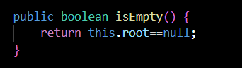
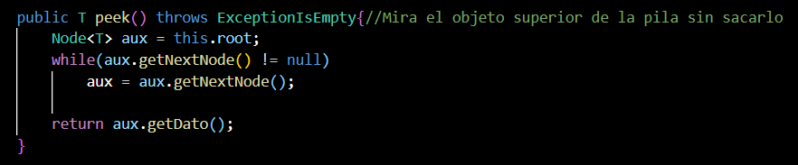
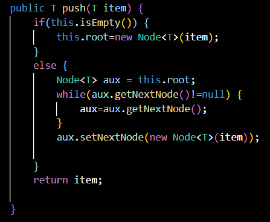
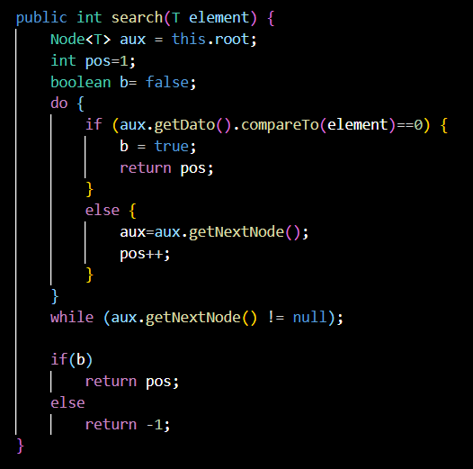
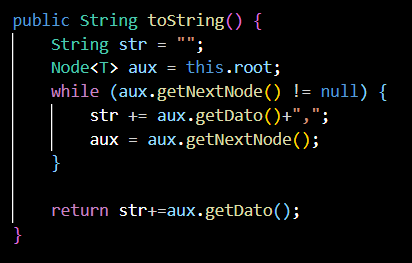
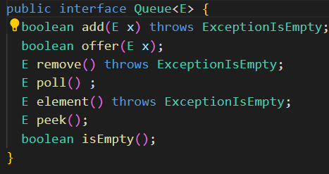
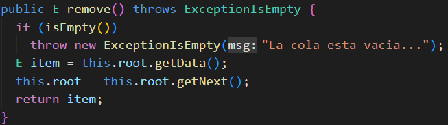
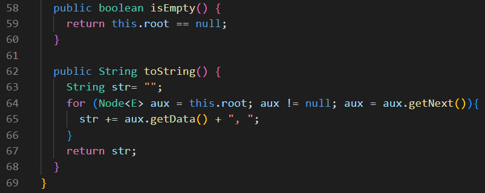
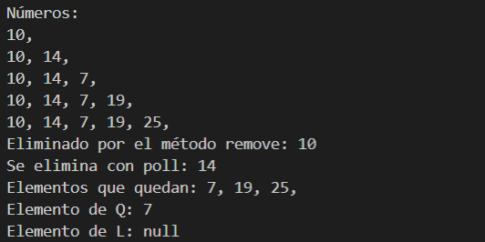

<table>
    <theader>
        <tr>
            <td></td>
            <th>
                UNIVERSIDAD NACIONAL DE SAN AGUSTIN 
                FACULTAD DE INGENIERÍA DE PRODUCCIÓN Y SERVICIOS 
                DEPARTAMENTO ACADÉMICO DE INGENIERÍA DE SISTEMAS E INFORMÁTICA 
                ESCUELA PROFESIONAL DE INGENIERÍA DE SISTEMAS
            </th>
            <td></td>
        </tr>
    </theader>
    <tbody>
        <tr><td colspan="3">Formato:Informe de Práctica de Laboratorio</td></tr>
        <tr><td>Aprobación:  2022/03/01</td><td>Código: GUIA-PRLD-001</td><td>Página: 1</td></tr>
    </tbody>
</table>

INFORME DE LABORATORIO 

<table>
<theader>
<tr><th colspan="6">INFORMACIÓN BÁSICA</th></tr>
</theader>
<tbody>
<tr><td>ASIGNATURA:</td><td colspan="5">Estructura de Datos y Algoritmos</td></tr>
<tr><td>TÍTULO DE LA PRÁCTICA:</td><td colspan="5">Pilas y Colas</td></tr>
<tr>
<td>NÚMERO DE PRÁCTICA:</td><td>03</td><td>AÑO LECTIVO:</td><td>2023 A</td><td>NRO. SEMESTRE:</td><td>III</td>
</tr>
<tr>
<td>FECHA DE PRESENTACIÓN:</td><td>08-Junio-2023</td><td>HORA DE PRESENTACIÓN:</td><td colspan="3">23:55</td>
</tr>
<tr><td colspan="4">Integrantes:
        <ul>
            <li><h5>Flores Sucapuca, Ervin Eleazar </h5></li>
        </ul>
    </td>
    <td colspan="2">Nota:</td>
</<tr>
<tr><td colspan="6">DOCENTES:
<ul>
<li>Mg. Richart Smith Escobedo Quispe</li>
<li>Mg. Edith Giovanna Cano Mamani</li>
<li>Mg. Jeymi Melanie Valdivia Eguiluz</li>
</ul>
</td>
</<tr>
</tdbody>
</table>

<table>
    <theader>
        <tr><th colspan="6">SOLUCIÓN Y RESULTADOS</th></tr>
    </theader>
    <tbody>
        <tr><td colspan="6">I. SOLUCIÓN DE EJERCICIOS/PROBLEMAS
	  
Las clases <a href="Nodo.java">Nodo.java</a> <a href="Stack2.java">Stack2.java</a> <a href="StackArray.java">StackArray.java</a> son otra implementacion de una pila para probarlo ejecute <a href="Test.java">Test.java</a>

          <ul>
          <li><strong>I. Pilas iguales (6 puntos)</strong>
             <ul>
	     	<li>
			Ver <a href="PilasIguales.java">PilasIguales</a>: La solución consiste en apilar alturas a medida que se itera sobre el vector de números. Por ejemplo: Se tiene el vector <code>int[] a = {1, 1, 2}</code>, entonces en una Pila previamente creada se hará push de: <code>(1), (1 + 1), (1 + 1 + 2)</code> con este procedimiento se obtienen las alturas a medida que se avanza en el vector. Una vez obtenido las pilas de alturas de los 3 vectores, se comienza a buscar una altura que este al mismo nivel en las 3 pilas; si es encontrado el programa acaba, de lo contrario se usa la función <code>pop()</code> en la pila que tenga mas altura y vuelve a comprobarse la condición inicial. Si no se encontró una altura conincidente, al final una de las pilas tendra 0 elementos y acaba el programa retornando 0.
		</li>
 	     	<li>
		    La clase <a href="PilasIguales.java">PilasIguales.java</a> cuenta con dos pruebas: una sin comentar y otra comentada con los simbolos<code>/*</code> <code>*/</code> en el metodo <code>public static void main(String[] args)</code>. Para cambiar el contenido del vector, modifique los numeros; puede agregar o quitar elementos, pero siempre deben estar separados por una <code>, </code>, el metodo <code>equalStacks()</code> solo puede recibir 3 vectores, entonces no quite ni agregue otro vector</li>
	    </ul>
           </li>
          </ul>
          <ul>
          <li><strong>II. Pilas (6 puntos)</strong>
          <ul>
	     <li></li>
	      </ul>
           <li>En este metodo lo unico que sea hace es comparar la raiz, ya que si esta se encuentra vacia nos indica que no hay ningun elemento en la pila.</li>
             <ul>
	     <li></li>
	      </ul>
           <li>En el metodo peek se recorre la pila hasta llegar al ultimo elemento que es el que esta en la parte superior de la pila y lo muestra.</li>
           <ul>
	     <li></li>
	      </ul>
           <li>En este metodo llamado pop, tambien se recorre la pila hasta llegar al ultimo elemento el cual es sacado de la pila y mostrado.</li>
           <ul>
	     <li></li>
	      </ul>
           <li>En este metodo, recorremos la pila para llegar al ultimo elemento al cual le añadimos la referencia del nuevo nodo(que contiene el nuevo dato a ingresar).</li>
           <ul>
	     <li></li>
	      </ul>
           <li>En este metodo search, se recorre la pila buscando el elemento deseado devolviendo su posicion y en caso este elemento no se encuentre devuelve -1.</li>
           <ul>
	     <li></li>
	      </ul>
           <li>Lo único que hace este elemento es imprimir la pila.</li>
          </ul>
          <ul>
		  <li><strong>III. Colas (6 puntos)</strong>
             <ul>
	            <li></li>
		  </ul>
	     <li> Se coloca un interface donde contiene los métodos Queue, donde tres de ellos (add, remove, element) son parecidos a otros tres, solo que estos votan una excepción.</li><ul>
		  <li></li>
              </ul>
		  <li>En la imagen se observa como se usa el add, en la cual en la condición if, verifica si esta vacio o no, para colocar en primera el elemento o recorrer la cola y colocar al final el elemento.</li>
		  <ul>
			  <li></li>
		  </ul>
		  <li> Se da el mismo comportamiento del <em>Add()</em> para el remove y el element, no obstante este elimina un nodo, reemplazandolo por el siguiente del siguiente en caso del remove y en el element simplemente arroja el elemento cabecera de la cola.</li> 
		  <ul>
			<li></li>
		  </ul>
		  <li> Los métodos mostrados en la imagen tienen como función, verificar si la cola esta vacio o tiene elementos y el otro imprime lo que contiene la cola; respectivamente. Para verificar todos estos métodos se crea la clase <strong><em>Test3</em></strong> donde se tiene el siguiente resultado.</li>
		  <ul>
			  <li></li>
		  </ul>
           </li>
          </ul>
          </td></tr>   
        <tr><td colspan="6">II. SOLUCIÓN DEL CUESTIONARIO
         <ul>
         <li>¿Qué similitudes hay entre una Lista Enlazada y una Pila? ( 1 pt)
              <ul>
                   <li>Ambos trabajan con nodos, los cuales ademas de almacenar un dato tambien almacenan la referencia del siguiente nodo.</li>
 	       </ul>
 		<ul>
                   <li> Ambas son ideales para reforzar reglas de acceso secuencial lo que permite tener el control de quien entra y quien sale.</li>
 	       </ul>
          </li>
        <li>¿En que casos seria favorable/desfavorable utilizar Pila/Cola? ( 1 pt)
	<li>Pilas
	   <ul>
                <li>Favorable 
		    <ul>
			<li>En realizar la operacion deshacer en los editores de texto.</li>
			<li>Para ir hacia "atras" o "siguiente" en los botones de navegacion.</li>
		    </ul>
		</li>
		<li>Desfavorable
		    <ul>
			<li> En casos que requieran demasiado uso de memoria debido a su escaso limite de memoria.</li>
			<li>Quere acceder a un elemento se tiene que remover todo hasta llegar a el y volver a colocar .</li>
		    </ul>
		</li> 
          </ul>
	</li>
	<li>Colas
	   <ul>
               <li>Favorable 
		    <ul>
			<li> Cuando un recurso se comparte entre diferentes usuarios, 
				por ejemplo imprimir en una sola impresora.</li>
			<li>En el orden de proceso de operaciones de una CPU.</li>
		    </ul>
		</li>
		<li>Desfavorable
		    <ul>
			<li>Querer quitar elementos que se encuentren en la mitad puede llegar a ser un proceso que requiera mucho tiempo.</li>
			<li>La búsqueda de algún elemento en específico puede ser una tarea ineficiente.</li>
		    </ul>
		</li> 
          </ul>
	</li>
        </li>
         </ul>
        </td></tr>
        <tr><td colspan="6">III. CONCLUSION
           <li>Tanto las pilas como las colas son colecciones de elementos organizados pero con diferentes 
principios de ejecucion que son importantes en estructuras de datos y que pueden ser utilizados de manera eficiente
 en diferentes condiciones. </li>
</td></tr>
 </tbody>
</table>

<table>
    <theader>
        <tr><th>RETROALIMENTACIÓN</th></tr>
    </theader>
    <tbody>
         <tr><td colspan="6">                       </td></tr>
    </tbody>
</table>

<table>
    <theader>
        <tr><th>REFERENCIAS Y BIBLIOGRAFIA</th></tr>
    </theader>
    <tbody>
        <tr><td>
            <ul>
                <li>https://www.w3schools.com/java/</li>
                <li>https://www.eclipse.org/downloads/packages/release/2022-03/r/eclipse-ide-enterprise-java-and-web-developer</li>
                <li>https://docs.oracle.com/javase/8/docs/api/java/util/Stack.html</li>
                <li>https://docs.oracle.com/javase/8/docs/api/java/util/Queue.html</li>
            </ul></td>
        </tr>
    </tbody>
</table>
